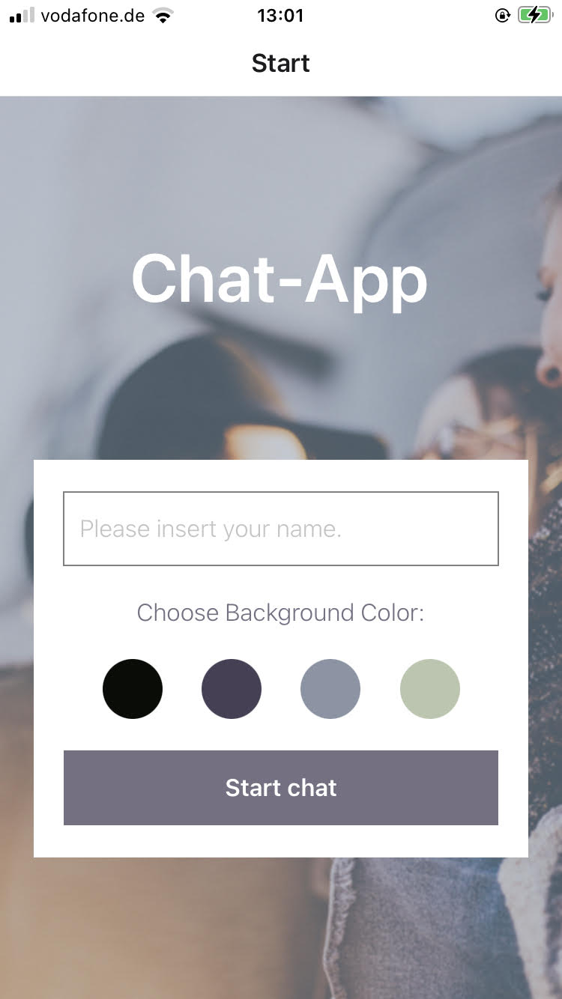
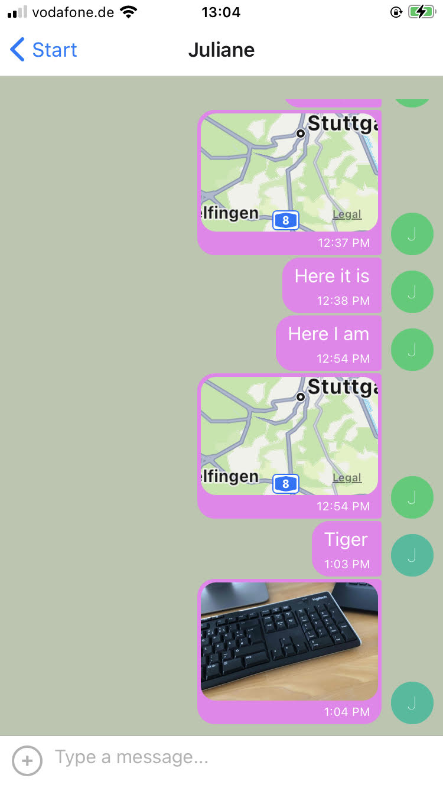
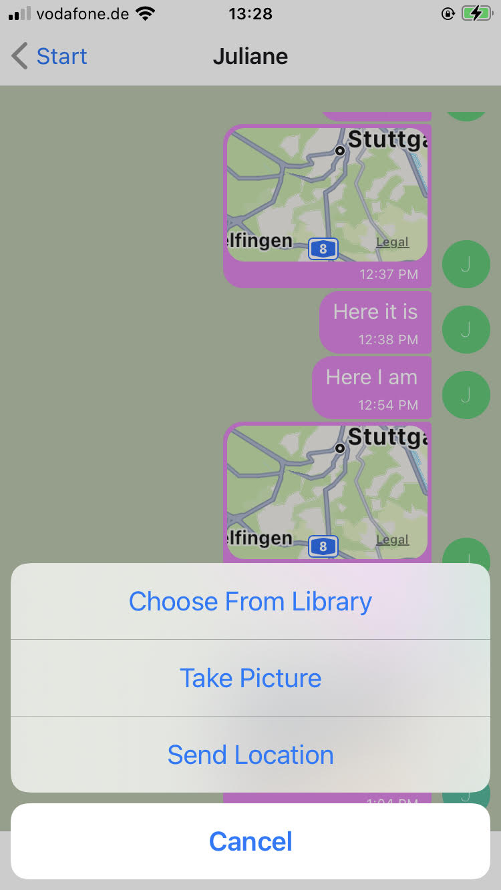

# Achievement 5 Project: React Native Mobile Chat App 

## Table of Contents

-   [Objective](#Objective)
-   [Features and Requirements](#Features-and-Requirements)
-   [Technologies the app was built with:](#technologies-the-app-was-built-with)
-   [Setup](#setup)
-   [Screenshots](#screenshots)

## Objective

To build a chat app for mobile devices using React Native. The app will provide users with a chat interface and options to share images and their location.

## Features and Requirements

### User Stories

-   As a new user, I want to be able to easily enter a chat room so I can quickly start talking to my friends and family.
-   As a user, I want to be able to send messages to my friends and family members to exchange the latest news.
-   As a user, I want to send images to my friends to show them what I’m currently doing.
-   As a user, I want to share my location with my friends to show them where I am.
-   As a user, I want to be able to read my messages offline so I can reread conversations at any
    time.
-   As a user with a visual impairment, I want to use a chat app that is compatible with a screen
    reader so that I can engage with a chat interface.

### Key Features

-   A page where users can enter their name and choose a background color for the chat screen before joining the chat.
-   A page displaying the conversation, as well as an input field and submit button.
-   The chat must provide users with two additional communication features: sending images
    and location data.
-   Data gets stored online and offline.

### Technologies the app was built with:

#### Frameworks/Libraries:

-   React Native
-   Expo/Expo Go
-   Gifted Chat

#### Database

-   Google Firebase

## Setup

1. Download this repository.
2. Open Visual Studio Code - navigate to Terminal and root directory of the project.
3. Run `npm install` to install all dependencies.
4. Run `npm start` or `expo start` in terminal in order to start local server.
5. Install Expo Go on smartphone or use an emulator such as Android Studio to start app via Expo.

## Screenshots

